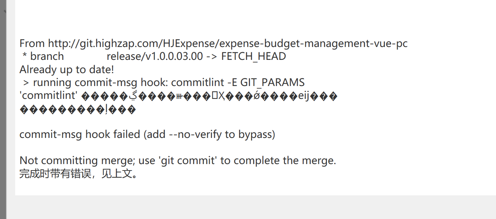
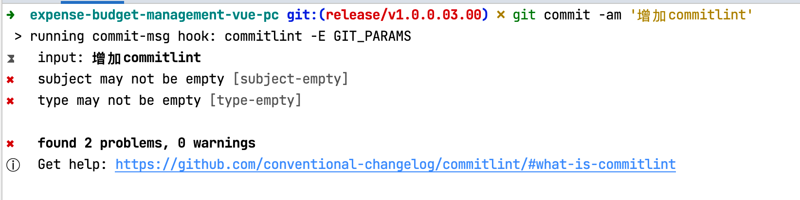
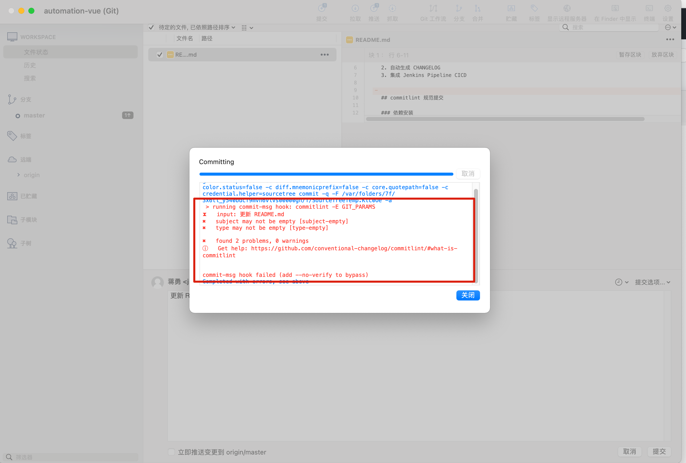
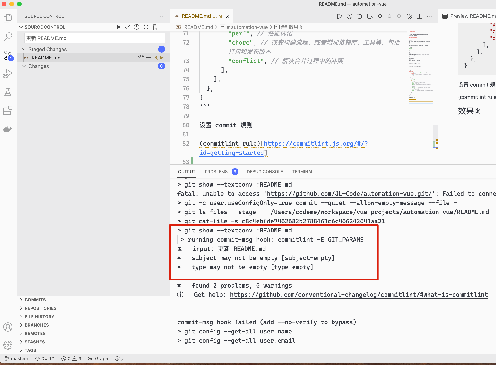
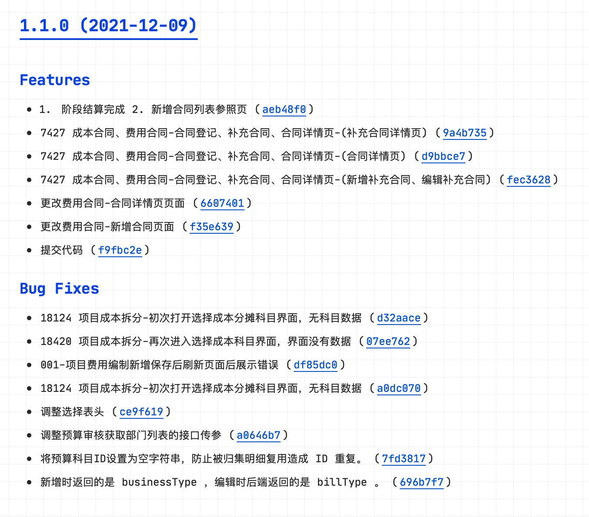
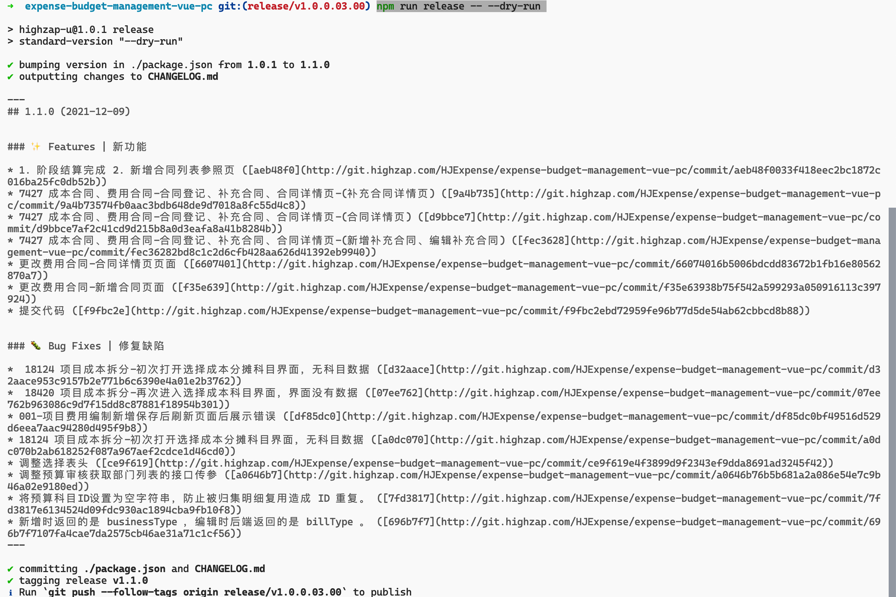

# automation-vue

## TODO

1. commit message 规范化【GUI 工具提交如何管控？】
2. 自动生成 CHANGELOG
3. 集成 Jenkins Pipeline CICD

## commitlint 规范提交

### 依赖安装

* `@commitlint/cli`
* `@commitlint/config-conventional`
* `@commitlint/parse`

> 📢：Windows 下依赖要全局安装。避免使用 GUI 提交时 commitlint 报错。 https://commitlint.js.org/#/
>
> ```sh
> npm install -g @commitlint/cli @commitlint/config-conventional
> ```
>
> 
>
> 

```shell
npm install @commitlint/config-conventional @commitlint/cli @commitlint/parse --save-dev
```


### 通过 gitHooks 启用 commitlint

`vue-cli` 创建的项目通过在 `package.json` 中 `gitHooks` 开启 commitlint。

```json
"gitHooks": {
  "commit-msg": "commitlint -E GIT_PARAMS"
}
```

### commit 规范参考

> https://docs.google.com/document/d/1QrDFcIiPjSLDn3EL15IJygNPiHORgU1_OOAqWjiDU5Y/edit#
> https://www.conventionalcommits.org/en/v1.0.0/
```sh
type(scope?): subject # scope is optional; multiple scopes are supported (current delimiter options: "/", "\" and ",")
```

现实的例子：

```sh
chore: run tests on travis ci
```

```sh
fix(预算科目): 17453-预算科目参照表格高度未自适应
```

```sh
feat: 7605-项目预算更新
```

### commitlint.config.js

配置 `commitlint.config.js` 文件 [用于配置 commitlint](https://commitlint.js.org/#/?id=getting-started)

```js
module.exports = {
  extends: ["@commitlint/config-conventional"],
  parserPreset: {
    parserOpts: {
      // issue 前缀，自动识别 #1234 为 issue，可在 commit message 中写入关闭的问题 id
      issuePrefixes: ["#"],
    },
  },
  rules: {
    "header-max-length": [0, "always", 100],
    "type-enum": [
      2,
      "always",
      [
        "feat", // feature 新功能，新需求
        "fix", // 修复 bug
        "docs", // 仅仅修改了文档，比如README, CHANGELOG, CONTRIBUTE等等
        "style", // 仅仅修改了空格、格式缩进、逗号等等，不改变代码逻辑
        "refactor", // 代码重构，没有加新功能或者修复bug
        "test", // 测试用例，包括单元测试、集成测试等
        "revert", // 回滚到上一个版本
        "perf", // 性能优化
        "chore", // 改变构建流程、或者增加依赖库、工具等，包括打包和发布版本
        "conflict", // 解决合并过程中的冲突
      ],
    ],
  },
}
```

## 效果图

### Command Line 失败场景



### SourceTree 失败场景




### VSCode 失败场景




## standard-version

### 安装依赖

```sh
npm install standard-version --save-dev
```

### 添加 release 脚本命令

在 `package.json` 的 `scripts` 增加 `release` 脚本，用于执行 `standard-version`

```json
  "scripts": {
    "release": "standard-version"
  }
```

默认情况下会把 commit 中 type 为 feat 的记录生成需求 log，fix 生成 bug 修复。如下图所示：



### 常用命令

> https://github.com/conventional-changelog/standard-version

* `npm run release -- --dry-run` 用于调试，改命令不会真正执行发版动作只会打印执行动作信息。
* `npm run release` 发版
  * --first-release 第一次发版
  * --release-as <name> 指定版本 eg: `npm run release -- --release-as 1.0.0.0301.00` 
  * --prerelease [name] 预发版本 eg: `npm run release -- --prerelease alpha`
  * --dry-run 试运行，打印出要执行的命令，不会提交代码。
  * --no-verify 不触发 `gitHooks`
  * --help 帮助



### 自定义配置

standard-verion 可以通过 .versionrc .versionrc.json .versionrc.js 文件进行自定义配置。具体配置信息 👉 [conventional-changelog-config-spec](https://github.com/conventional-changelog/conventional-changelog-config-spec/blob/master/versions/2.1.0/README.md)

.versionrc.json

```json
{
  "header": "变更日志",
  "bumpFiles": [
    { "filename": "./src/apps/ebs/manifest.json","type": "json"}, // 用于指定版本元数据文件路径，standard-verion 将修改该文件中的版本信息
    { "filename": "./package.json","type": "json"}
  ],
  "types": [
    { "type": "feat", "section": "✨ Features | 新功能" },
    { "type": "fix",  "section": "🐛 Bug Fixes | 修复缺陷"},
    { "type": "chore", "hidden": true },
    { "type": "docs",  "hidden": true },
    { "type": "style", "hidden": true },
    { "type": "refactor", "hidden": true, "section": "🪄 重构代码。不包括 bug 修复、功能新增"  },
    { "type": "perf","hidden": true,"section": "🚀 性能优化"  },
    { "type": "test", "hidden": true }
  ]
}
```


`commit url` 默认取 package.json 中 repository.url

```json
"repository": {
  "type": "git",
  "url": "git+https://github.com/joyran/yi-blog.git"
}
```

